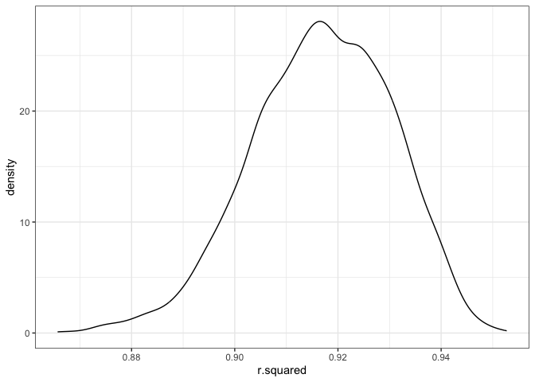
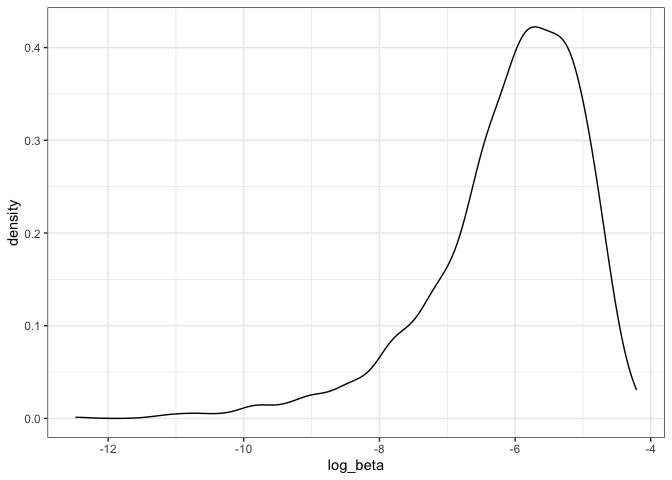

Homework 6
================
Yuki Joyama
2023-11-19

Read packages

``` r
library(tidyverse)
```

# Problem 1

``` r
# read csv file
df_homicide = read_csv("./data/homicide-data.csv")

# modify the dataframe
df_homicide = df_homicide |> 
  mutate(
    city_state = paste(city, state, sep = ", "), # create a city_state variable
    victim_age = as.numeric(victim_age), # change victim_age from char to numeric
    homicide = if_else(
      disposition == "Closed without arrest" | disposition == "Open/No arrest", "unsolved","resolved"
    ),
    homicide = as.factor(homicide)
  ) |>
  filter(!(city_state %in% c("Dallas, TX", "Phoenix, AZ", "Kansas City, MO", "Tulsa, AL"))) |> # omit some cities due to the lack of data or data entry mistake
  filter(victim_race %in% c("White", "Black")) |> # limiting data to white or black
  filter(victim_sex != "Unknown") |> # exclude unknown sex
  drop_na(victim_age) # exclude unknown age
```

Logistic regression for crime outcome and victim age, sex and race in
Baltimore, MD.

``` r
# run logistic regression for Baltimore, MD
log_baltimore = df_homicide |> 
  filter(city_state == "Baltimore, MD") |> 
  glm(homicide ~ victim_age + victim_sex + victim_race, family = binomial, data = _) |> 
  broom::tidy()

log_baltimore
```

    ## # A tibble: 4 × 5
    ##   term             estimate std.error statistic  p.value
    ##   <chr>               <dbl>     <dbl>     <dbl>    <dbl>
    ## 1 (Intercept)      -0.310     0.171       -1.81 7.04e- 2
    ## 2 victim_age        0.00673   0.00332      2.02 4.30e- 2
    ## 3 victim_sexMale    0.854     0.138        6.18 6.26e-10
    ## 4 victim_raceWhite -0.842     0.175       -4.82 1.45e- 6

``` r
# check the level of the outcome variable
levels(pull(df_homicide, homicide))
```

    ## [1] "resolved" "unsolved"

``` r
# odds ratio for coef and 95% CI 
log_baltimore |> 
  filter(term == "victim_sexMale") |> 
  mutate(
    or = exp(estimate), # calculate odds ratio of the coefficients
    lb.or = exp(estimate - qnorm(.975) * std.error), # obtain the lower level of 95% CI
    ub.or = exp(estimate + qnorm(.975) * std.error) # obtain the upper level of 95% CI
  ) |> 
  select(or, lb.or, ub.or) |> 
  knitr::kable(digits = 2)
```

|   or | lb.or | ub.or |
|-----:|------:|------:|
| 2.35 |  1.79 |  3.08 |

In Baltimore, MD, male victims have approximately 2.35 times the odds
(95% CI: 1.79 - 3.08) of resolved cases than the unresolved cases
compared to female victims when all other variables fixed.

Now run the logistic regression for each of the cities.

``` r
# set up a function to get odds ratio for coef and 95% CI from logistic regression output
or_ci_glm = function(df){
  df |> 
    filter(term == "victim_sexMale") |> 
    mutate(
      or = exp(estimate),
      lb.or = exp(estimate - qnorm(.975) * std.error),
      ub.or = exp(estimate + qnorm(.975) * std.error)
    ) |> 
    select(or, lb.or, ub.or) 
}


case_log = df_homicide |>
  nest(df = -city_state) |> 
  mutate(
    log_model = purrr::map(df, \(df) glm(homicide ~ victim_age + victim_sex + victim_race, family = binomial, data = df)), # save logistic models for each city as list
    results = map(log_model, broom::tidy) # save logistic model results in tibble as list
  ) |>
  mutate(
    ors = map(results, or_ci_glm) # save odds ratios and 95%CI as list
  ) |> 
  unnest(ors) |> 
  select(city_state, or, lb.or, ub.or) 
  
# visualize the results
case_log |> 
  mutate(city_state = fct_reorder(city_state, or)) |> 
  ggplot(aes(x = city_state, y = or)) +
  geom_point() +
  geom_errorbar(aes(x = city_state, ymin = lb.or, ymax = ub.or)) +
  labs(
    title = "The odds ratios of resolved cases among male compared to female",
    x = "City",
    y = "Odds ratio"
  ) +
  theme_bw() +
  theme(axis.text.x = element_text(angle = 90)) 
```

<!-- -->

From the plot, we can see that in Albuquerque, NM, the odds of cases to
be solved is the lowest in male compared to female holding other
variables (OR: 0.57, 95% CI: 0.27 - 1.2). In New York, NY, the odds of
resolved cases in male compared to female was the highest keeping all
other variables fixed (OR: 3.81, 95% CI: 2 - 7.25).

# Problem 2

``` r
# download dataset for this question
weather_df = 
  rnoaa::meteo_pull_monitors(
    c("USW00094728"),
    var = c("PRCP", "TMIN", "TMAX"), 
    date_min = "2022-01-01",
    date_max = "2022-12-31") |>
  mutate(
    name = recode(id, USW00094728 = "CentralPark_NY"),
    tmin = tmin / 10,
    tmax = tmax / 10) |>
  select(name, id, everything())

# function to get sample
boot_sample = function(df) {
  sample_frac(df, replace = TRUE)
}

set.seed(1)

# get bootstrap samples
boot_strp = tibble(strp_num = 1:5000) |> 
  mutate(
    strp_sample = map(strp_num, \(i) boot_sample(weather_df))
  )

# fit linear regression model for each sample data 
boot_results = boot_strp |> 
  mutate(
    models = map(strp_sample, \(df) lm(tmax ~ tmin + prcp, data = df)),
    results_lm = map(models, broom::tidy),
    results_glance = map(models, broom::glance)
  ) |> 
  unnest(results_lm, results_glance) |> 
  select(strp_num, term, estimate, r.squared) |> 
  pivot_wider(names_from = term, values_from = estimate, names_prefix = "estimate_") |> 
  mutate(
    log_beta = log(estimate_tmin * estimate_prcp) # calculate log(beta1*beta2)
  )

# plot the distribution of estimates
boot_results |> 
  ggplot(aes(x = r.squared)) + 
  geom_density() +
  theme_bw()
```

<!-- -->

``` r
boot_results |> 
  ggplot(aes(x = log_beta)) + 
  geom_density() +
  theme_bw()
```

<!-- -->

The estimate of $r^2$ and $log(\hat{\beta}_1*\hat{\beta}_2)$ show
left-skewed unimodal distribution. This indicates that there may be
variability in the data.  
\* 3361 out of 5000 $log(\hat{\beta}_1*\hat{\beta}_2)$ values were
removed from the plot because the log of a negative number could not be
calculated.

The 95% confidence interval for $r^2$ is 0.89 - 0.94;
$log(\hat{\beta}_1*\hat{\beta}_2)$ is -8.98 - -4.6
